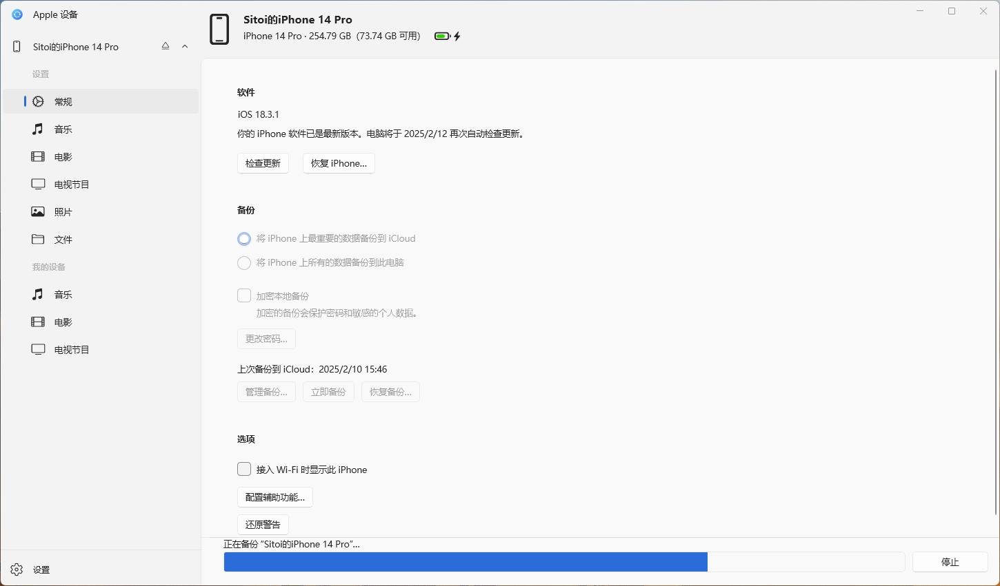

<h1 align="center">
  
  <br>WeCat 微信聊天记录分析报告 📊
<br>
</h1>

<p align="center">
  <a href="https://github.com/Sitoi/WeCat/releases"></a>
  <a href="LICENSE"></a>
  <a href="https://wecat.tech"></a>
</p>

<h5 align="center">🌟 WeCat 官方网站：https://wecat.tech</h5>

## ✨ 功能特点

- 📊 聊天记录可视化分析
- 🔒 本地数据处理，保护隐私
- 📱 支持多账号管理
- 🔄 支持导出分析结果
- 🌐 在线分享分析报告

## 📱 使用准备

### 第一步：iTunes 备份 🔄

#### MacOS

1. 用数据线连接 iPhone/iPad 到电脑
2. 打开 「访达」 ，在侧边栏 「位置」 选择对应的 iPhone/iPad 设备
3. 选择 「将 iPhone 上所有的数据备份到此 Mac」
4. ⚠️ **重要提示**：备份时请勿选择「加密本地备份」选项


#### Windows 10 / Windows 11

1. 下载 [「Apple 设备」](https://apps.microsoft.com/detail/9NP83LWLPZ9K?hl=zh-cn&gl=CN&ocid=pdpshare)
2. 用数据线连接 iPhone/iPad 到电脑
3. 打开 「Apple 设备」 进行备份，选择 「将 iPhone 上所有的数据备份到此电脑」
4. ⚠️ **重要提示**：备份时请勿选择「加密本地备份」选项



### 第二步：下载安装 💾

1. 从 [GitHub Releases](https://github.com/Sitoi/WeCat/releases) 下载最新版本
2. 解压下载的文件
3. 运行 `WeCat` 程序


> 注意 ⚠️：由于 macOS 不允许打开未签名的程序，如果出现软件无法打开请进行以下操作

```bash
# 终端执行
sudo xattr -d com.apple.quarantine "/Applications/wecat.app"
```

```txt
# 安全设置
进入 「设置」- 「安全性与隐私」- 「通用」- 「允许从以下位置下载的 App」-「仍然打开」
```

## 🚀 使用教程

### 1️⃣ 选择账号

选择「备份文件」并打开，然后选择需要分析的微信账号

> 💡 如果只有单个账号，将自动跳过选择步骤


### 2️⃣ 分析聊天记录

选择想要分析的联系人，系统将自动生成分析报告


### 3️⃣ 导出结果

点击右上角「导出分析」按钮，保存分析结果 📤

### 4️⃣ 在线分享

1. 将导出的分析文件发送给对方
2. 对方访问 [WeCat 官网](https://wecat.tech)
3. 上传分析文件即可查看详细报告 🔗

## 样例

### 移动端样例效果


> 🔒 **隐私承诺**：所有数据分析均在本地完成，不会上传服务器存储。

## 🤝 参与贡献

欢迎加入 WeCat 开源社区！

- 🐛 发现 Bug？请提交 [Issue](https://github.com/Sitoi/WeCat/issues)
- 💡 有新想法？欢迎提交 [Pull Request](https://github.com/Sitoi/WeCat/pulls)
- ⭐️ 喜欢项目？请给我们 Star 支持

## 📝 开源协议

本项目采用 [GPLv3 许可证](LICENSE) 开源，使用时请遵守开源协议。

## 📮 联系我们

- 官方网站：[https://wecat.tech](https://wecat.tech)
- GitHub：[https://github.com/Sitoi/WeCat](https://github.com/Sitoi/WeCat)
